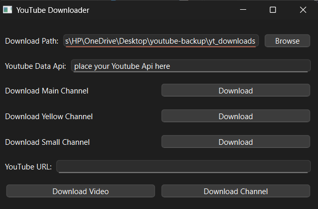

# 📺 YouTubeAutoBackupTool

A professional PySide6-based Python application that automatically downloads and backs up YouTube videos and channels.

## 📌 Overview

YouTubeAutoBackupTool helps you easily download and organize YouTube videos from channels you want to back up. It provides a user-friendly interface and handles organizing videos into structured folders with proper filenames.

### 🚀 Features

- ✅ Downloads all videos from a channel or individual videos  
- ✅ Organizes videos into structured folders based on channel name  
- ✅ Downloads video thumbnails and descriptions  
- ✅ Shows download progress visually with progress bars 
- ✅ Handles multiple downloads using threading  
- ✅ Automatically formats filenames with upload date  
- ✅ Runs in the background while you work on other tasks

## 📋 Requirements

- Python 3.7+
- PySide6
- yt-dlp
- YouTube Data API key (for channel downloads)

## 🔧 Installation

### Standard Installation

1. Clone this repository:
```bash
git clone https://github.com/ashmita41/YouTubeAutoBackupTool.git
cd YouTubeAutoBackupTool
```

2. Install the required dependencies using pip:
```bash
pip install -r requirements.txt
```

### Installation with uv (Recommended)

[uv](https://github.com/astral-sh/uv) is a fast Python package installer and resolver. For the best experience, we recommend using it:

1. Install uv if you don't have it:
```bash
pip install uv
```

2. Install dependencies using uv:
```bash
uv pip install -r requirements.txt
```

3. Or create a virtual environment with uv:
```bash
uv venv .venv
.venv\Scripts\activate  # On Windows
# or
source .venv/bin/activate  # On macOS/Linux
uv pip install -r requirements.txt
```

## 🚀 Usage

1. Run the application:
```bash
python main.py
```

2. Enter your YouTube Data API key (required for channel downloads)
3. Enter a YouTube URL (video or channel)
4. Click "Download Video" or "Download Channel"
5. Or use the preconfigured channel buttons to download specific channels

### Getting a YouTube Data API Key

1. Go to the [Google Cloud Console](https://console.cloud.google.com/)
2. Create a new project
3. Navigate to APIs & Services > Library
4. Search for "YouTube Data API v3" and enable it
5. Go to APIs & Services > Credentials
6. Create an API key and copy it
7. Paste it into the application's YouTube Data API field

### Example: Downloading a Single Video

1. Copy a YouTube video URL (e.g., https://www.youtube.com/watch?v=dQw4w9WgXcQ)
2. Paste it into the "YouTube URL" field
3. Click "Download Video"
4. The video will be downloaded to your specified download folder with proper formatting

### Example: Downloading a Channel

1. Find a YouTube channel URL (e.g., https://www.youtube.com/channel/UC_x5XG1OV2P6uZZ5FSM9Ttw)
2. Paste it into the "YouTube URL" field
3. Enter your YouTube Data API key
4. Click "Download Channel"
5. All videos from the channel will be downloaded and organized in a folder

## 📁 Project Structure

```
YouTubeAutoBackupTool/
│
├── src/                # Source code
│   ├── __init__.py     # Package initialization
│   ├── downloader.py   # Download functionality
│   ├── ui.py           # User interface
│   └── utils.py        # Utility functions
│
├── tests/              # Tests
│   ├── __init__.py     # Tests package
│   ├── run_tests.py    # Script to run all tests
│   └── test_utils.py   # Tests for utils
│
├── docs/               # Documentation
│   └── usage.md        # Usage documentation
│
├── data/               # Data storage
│
├── main.py             # Entry point
├── requirements.txt    # Dependencies
├── pyproject.toml      # Project configuration
└── README.md           # This file
```

## 📷 Screenshots



## 🤝 Contributing

Contributions are welcome! Please feel free to submit a Pull Request.

## 📄 License

This project is licensed under the MIT License - see the LICENSE file for details.

## 🙏 Acknowledgements

- [yt-dlp](https://github.com/yt-dlp/yt-dlp) for the amazing YouTube downloading functionality
- [PySide6](https://wiki.qt.io/Qt_for_Python) for the GUI framework 